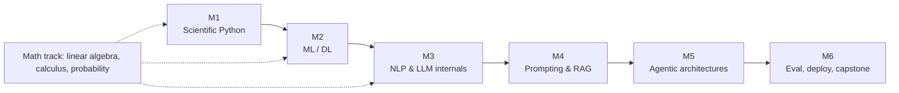
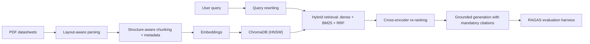
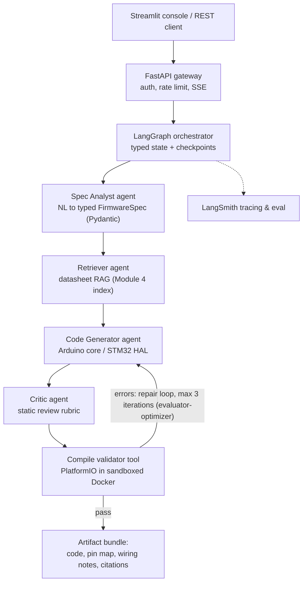

# Agentic AI Engineering — A 6-Month Technical Curriculum

**From Embedded Systems Engineering to Autonomous LLM Systems**


| | |
|---|---|
| **Candidate** | Hajer — Electronics Engineer (embedded systems, C/C++) |
| **Target role** | Agentic AI Engineer (LLM applications, autonomous multi-agent systems) |
| **Duration** | 6 months · 24 weeks · 10–15 h/week core + 2–3 h/week math track (~320–430 h total) |
| **Method** | Project-driven: each month closes with a shippable, evaluated deliverable committed to this repository |
| **Domain anchor** | Every project is grounded in electronics/embedded use cases to compound existing domain expertise |

---

## Abstract

This repository defines a rigorous, engineering-grade curriculum for transitioning from embedded electronics engineering to Agentic AI engineering. The program is structured as six monthly modules with a parallel mathematics track (Months 1–3). It progresses from scientific Python and classical machine learning through Transformer internals, retrieval-augmented generation (RAG), and agentic architectures (ReAct, Reflection, Planning, orchestrator–workers, evaluator–optimizer), and terminates in a production-grade capstone: **EmbedAI Copilot**, a multi-agent system that synthesizes, reviews, and compile-validates microcontroller firmware (Arduino/STM32) from natural-language specifications. All deliverables carry explicit functional requirements, acceptance criteria, and evaluation harnesses.

---

## Table of Contents

1. [Program Overview](#1-program-overview)
2. [Candidate Profile & Skill Transfer Map](#2-candidate-profile--skill-transfer-map)
3. [Technology Stack](#3-technology-stack)
4. [Program Architecture](#4-program-architecture)
5. [Mathematical Foundations Track (Months 1–3)](#5-mathematical-foundations-track-months-13)
6. [Module 1 — Scientific Python & Software Engineering](#6-module-1--scientific-python--software-engineering)
7. [Module 2 — Machine Learning & Deep Learning](#7-module-2--machine-learning--deep-learning)
8. [Module 3 — NLP & Transformer/LLM Internals](#8-module-3--nlp--transformerllm-internals)
9. [Module 4 — Prompt Engineering & Retrieval-Augmented Generation](#9-module-4--prompt-engineering--retrieval-augmented-generation)
10. [Module 5 — Agentic Architectures & Design Patterns](#10-module-5--agentic-architectures--design-patterns)
11. [Module 6 — Evaluation, Deployment & Capstone](#11-module-6--evaluation-deployment--capstone)
12. [Capstone Specification — EmbedAI Copilot](#12-capstone-specification--embedai-copilot)
13. [Engineering Standards](#13-engineering-standards)
14. [Repository Layout](#14-repository-layout)
15. [Progress Tracking](#15-progress-tracking)
16. [References](#16-references)

---

## 1. Program Overview

### 1.1 Objectives

Upon completion, the candidate will be able to:

| # | Learning outcome | Verified by |
|---|---|---|
| O1 | Write idiomatic, tested, typed Python and vectorized numerical code (NumPy/Pandas) | Module 1 deliverable + pytest suite |
| O2 | Train, regularize, and evaluate classical ML and neural models; reason about bias–variance, optimization, and metrics | Module 2 deliverable (predictive maintenance) |
| O3 | Explain Transformer internals (attention, KV cache, positional encodings, sampling) and fine-tune pretrained models (full & LoRA/PEFT) | Module 3 deliverable + written notes |
| O4 | Design and quantitatively evaluate RAG pipelines (chunking, hybrid retrieval, re-ranking, faithfulness metrics) | Module 4 deliverable (datasheet RAG) |
| O5 | Implement agentic design patterns (ReAct, Reflection, Planning, routing, parallelization, orchestrator–workers, evaluator–optimizer) as LangGraph state machines and CrewAI/AutoGen crews | Module 5 pattern library + multi-agent project |
| O6 | Ship, trace, evaluate, and secure an LLM system in production (LangSmith, FastAPI, Docker, OWASP LLM Top 10) | Module 6 + capstone acceptance tests |
| O7 | Refresh the mathematics underpinning ML: linear algebra (SVD), differential calculus (backpropagation), probability (MLE, cross-entropy/KL) | Math track exercise notebooks |

### 1.2 Methodology

- **Project-first.** Theory is consumed just-in-time; every module ends in a working artifact with an evaluation harness.
- **Compounding domain advantage.** Datasets and use cases are drawn from electronics (sensor telemetry, component datasheets, firmware synthesis) so prior expertise multiplies rather than resets.
- **Engineering discipline throughout.** Version control, typed code, unit tests, CI, reproducible environments, and secrets hygiene are required from week 1 (see [§13](#13-engineering-standards)).
- **Measurable exit criteria.** Each module defines acceptance criteria; the capstone defines functional/non-functional requirements and a quantitative evaluation set.

### 1.3 Time Budget

| Track | Load | Weeks | Total |
|---|---|---|---|
| Core curriculum | 10–15 h/week | 24 | 240–360 h |
| Mathematics track | 2–3 h/week | 12 | 24–36 h |
| Capstone hardening buffer | — | included in M6 | ~40 h |

---

## 2. Candidate Profile & Skill Transfer Map

Prior competencies from electronics/embedded engineering map directly onto Agentic AI engineering concerns:

| Existing competency (EE / embedded) | Transfers to (Agentic AI) |
|---|---|
| C/C++, memory models, pointers, build toolchains | Python internals (CPython object model, GC), performance reasoning, native extension awareness |
| Finite-state machines, control loops, interrupt-driven design | Agent runtimes as state machines (LangGraph `StateGraph`), event loops, ReAct reason→act→observe cycles |
| Signal processing, sensor calibration, noise budgets | Feature engineering, normalization, drift detection, data quality gates |
| Control theory (feedback, stability) | Optimization dynamics (gradient descent, momentum/Adam), evaluator–optimizer agent loops |
| Datasheet-driven design, tolerance analysis | Grounded generation with citation constraints; structured output schemas; verification-first mindset |
| Bench debugging, oscilloscope-style observability | LLM tracing (LangSmith spans), token/cost/latency profiling, regression harnesses |

**Assumed prerequisites:** procedural/OO programming, engineering mathematics (once, now refreshed in §5), basic Linux shell, Git fundamentals.

**Explicit non-goals:** CUDA kernel programming, training foundation models from scratch, classical robotics.

---

## 3. Technology Stack

### 3.1 Core

| Layer | Technology | Purpose |
|---|---|---|
| Language | Python ≥ 3.11 (type hints, `dataclasses`, `asyncio`) | Primary implementation language |
| Env & packaging | `uv` (or `venv` + `pip-tools`), `pyproject.toml` | Deterministic, reproducible environments |
| Numerics | NumPy, Pandas, Matplotlib | Vectorized computation, tabular data, diagnostics |
| Classical ML | scikit-learn | Regression/classification baselines, model selection |
| Deep learning | PyTorch 2.x (`torch.nn`, `autograd`, `DataLoader`) | Neural network implementation and training |
| LLM APIs | OpenAI API (chat completions, structured outputs, function calling), Hugging Face `transformers`/`datasets`/`peft` | Inference, fine-tuning, tokenization |
| Retrieval | ChromaDB (HNSW), FAISS, `rank_bm25`, sentence-transformers, cross-encoder re-rankers | Dense/sparse/hybrid retrieval, re-ranking |
| Orchestration | LangChain, **LangGraph** (state graphs, checkpointers), **CrewAI**, AutoGen | Agent runtimes and multi-agent coordination |
| Evaluation | LangSmith (tracing/datasets/evaluators), RAGAS, pytest | Offline/online evaluation, regression testing |
| Serving | FastAPI (async, SSE streaming), Streamlit, Uvicorn | APIs and operator UI |
| Ops | Docker (multi-stage), GitHub Actions, `python-dotenv`, pre-commit, ruff, mypy | CI, reproducibility, hygiene |

### 3.2 Capstone-specific

| Concern | Technology |
|---|---|
| Firmware targets | Arduino (AVR/ESP32 cores), STM32 (HAL/LL) |
| Compile validation | PlatformIO CLI (`pio ci`) inside a sandboxed Docker image; `arm-none-eabi-gcc`, `avr-gcc` toolchains |
| Peripherals in scope | GPIO, UART, I2C, SPI, PWM, ADC; DHT22, MQTT (`PubSubClient`) reference flows |

---

## 4. Program Architecture



Artifact dependency chain: the Module 4 RAG index (datasheets) and the Module 5 pattern library are **direct runtime dependencies** of the capstone; Modules 1–3 supply the numerical, modeling, and LLM fundamentals they rest on.

---

## 5. Mathematical Foundations Track (Months 1–3)

Parallel track, 2–3 h/week. Primary resource: **Steve Brunton — [@Eigensteve](https://www.youtube.com/@Eigensteve)** (University of Washington), whose control-theoretic, engineering-first treatment is optimal for this profile. Companion text: Brunton & Kutz, *Data-Driven Science and Engineering* ([databookuw.com](http://databookuw.com)).

| Module | Topics | Primary material | Deliverable |
|---|---|---|---|
| **A — Linear algebra** (Month 1) | Vector spaces, norms, orthogonality; eigendecomposition; **SVD** — low-rank approximation, PCA equivalence, condition number; connection to embedding geometry (cosine similarity) | Eigensteve *SVD* playlist; 3Blue1Brown *Essence of Linear Algebra* | Notebook: SVD image compression + PCA on sensor telemetry |
| **B — Calculus & optimization** (Month 2) | Partial derivatives, Jacobians; **chain rule → backpropagation** derivation; gradient descent, SGD, momentum, **Adam**; learning-rate schedules; convexity intuition | Eigensteve optimization/gradient videos; 3Blue1Brown *Essence of Calculus* | Notebook: manual backprop on a 2-layer MLP, verified against `torch.autograd` |
| **C — Probability & statistics** (Month 3) | Random variables, common distributions, expectation/variance; **MLE**; Bayes' theorem; **entropy, cross-entropy, KL divergence** and their role as loss functions; evaluation statistics (confidence intervals) | Eigensteve probability/data-driven videos; StatQuest | Notebook: MLE for a sensor-noise model; cross-entropy vs. KL numeric study |

- [ ] Math A complete — SVD/PCA notebook committed
- [ ] Math B complete — manual backprop matches autograd to `1e-6`
- [ ] Math C complete — MLE + cross-entropy notebook committed

Key identity carried through the whole program — scaled dot-product attention (used in §8):

$$\mathrm{Attention}(Q,K,V) = \mathrm{softmax}\left(\frac{QK^{\top}}{\sqrt{d_k}}\right)V$$

---

## 6. Module 1 — Scientific Python & Software Engineering

**Objective.** Convert C/C++ fluency into production-quality Python and vectorized numerical computing.

### 6.1 Technical scope

- **Language core:** iterators/generators, comprehensions, context managers, decorators, `dataclasses`, `enum`, pattern matching; exceptions and error taxonomies; `typing` (generics, `Protocol`, `TypedDict`); differences vs. C/C++ (dynamic typing, GC, GIL implications for CPU-bound vs. I/O-bound work, `asyncio` as the concurrency model of LLM apps).
- **Numerics:** NumPy ndarray memory layout (dtypes, strides), broadcasting semantics, vectorization vs. Python loops (benchmark: ≥ 50× speedup on rolling statistics), `einsum` basics.
- **Data engineering:** Pandas indexing (`loc`/`iloc`), `groupby` aggregation, joins, time-series resampling (`resample`, rolling windows), categorical dtypes, missing-data policy.
- **Tooling baseline (kept for all subsequent modules):** `uv`-managed venvs, `pyproject.toml`, ruff (lint+format), mypy, pytest (fixtures, parametrization), pre-commit, Conventional Commits.

### 6.2 Weekly plan

- [ ] **W1:** Toolchain bootstrap (Python 3.11, uv, VS Code, Git). Syntax deep-dive with a C/C++ contrast table. First typed, tested CLI utility.
- [ ] **W2:** OOP (dunder protocol, composition vs. inheritance, ABCs vs. `Protocol`), packaging a reusable module, exception design, logging (`logging` with structured formatters).
- [ ] **W3:** NumPy internals + Pandas pipelines on real sensor CSVs; profiling with `timeit`/`cProfile`; vectorization benchmark report.
- [ ] **W4:** Matplotlib diagnostics (time series, spectrograms via `numpy.fft`), project assembly, test coverage ≥ 80%, CI green.

### 6.3 Deliverable — `sensor-analyzer`

CLI tool ingesting multi-channel sensor telemetry (temperature, voltage, current; CSV):

| Requirement | Detail |
|---|---|
| FR-1 | Schema validation and unit normalization on ingest |
| FR-2 | Cleaning: interpolation policy for gaps, spike rejection (Hampel filter), drift detection via rolling z-score |
| FR-3 | Anomaly report: threshold + `k·σ` violations with timestamps, exported as Markdown + PNG plots |
| FR-4 | FFT-based periodicity summary per channel |
| **Acceptance** | ≥ 80% test coverage; end-to-end run on a 1M-row dataset < 10 s; zero mypy errors |

---

## 7. Module 2 — Machine Learning & Deep Learning

**Objective.** Command the full supervised-learning workflow and PyTorch training loops, with statistically sound evaluation.

### 7.1 Technical scope

- **Statistical learning:** bias–variance decomposition; train/validation/test protocol; stratified k-fold CV; leakage prevention; L1/L2 regularization; hyperparameter search (grid vs. random; Optuna-style Bayesian search noted).
- **Models:** linear/logistic regression (closed form vs. gradient methods), decision trees (Gini vs. entropy), random forests, gradient boosting (concept), kNN; when classical models beat deep nets on tabular data.
- **Metrics:** precision/recall/F1, ROC-AUC vs. PR-AUC under class imbalance; calibration (reliability curves); cost-sensitive thresholds; imbalance handling (class weights, SMOTE — with its pitfalls).
- **Deep learning:** MLP from first principles; activation functions and vanishing gradients; initialization (Xavier/He); batch normalization; dropout; optimizers (SGD → momentum → Adam/AdamW); LR schedules and warmup; early stopping.
- **PyTorch:** `Tensor` semantics and devices, `autograd` graph, `nn.Module` composition, `Dataset`/`DataLoader`, training/eval loops with metric logging, checkpointing, reproducibility (seeds, `torch.use_deterministic_algorithms`).

### 7.2 Weekly plan

- [ ] **W1:** Regression + regularization on tabular data; residual analysis; scikit-learn `Pipeline`/`ColumnTransformer` to prevent leakage.
- [ ] **W2:** Classification zoo + rigorous evaluation under imbalance; model selection report with CV confidence intervals.
- [ ] **W3:** MLP forward/backward by hand (ties to Math B); reimplementation in PyTorch; overfit-then-regularize exercise on a small split.
- [ ] **W4:** Full PyTorch training pipeline with early stopping + checkpointing; deliverable assembly and ablation table.

### 7.3 Deliverable — `predictive-maintenance`

Failure prediction for electronic/mechanical components on a public benchmark (**AI4I 2020 Predictive Maintenance** (UCI) or **NASA C-MAPSS** turbofan RUL):

| Requirement | Detail |
|---|---|
| FR-1 | Reproducible data pipeline (fixed splits, seeded), feature documentation |
| FR-2 | Baselines: logistic regression + random forest with stratified 5-fold CV |
| FR-3 | PyTorch MLP with early stopping; ablation over depth/dropout/BatchNorm |
| FR-4 | Report: PR-AUC (primary, due to imbalance), ROC-AUC, F1 at cost-optimal threshold, calibration curve |
| **Acceptance** | MLP or ensemble beats majority-class baseline by a documented, statistically defensible margin; single-command reproduction (`make train && make report`) |

---

## 8. Module 3 — NLP & Transformer/LLM Internals

**Objective.** Understand the Transformer stack deeply enough to predict system behavior (context limits, latency, sampling artifacts) and fine-tune pretrained models.

### 8.1 Technical scope

- **Tokenization:** BPE, WordPiece, unigram LM; `tiktoken` in practice; token-count ⇒ cost/latency budgeting; multilingual and code-tokenization edge cases.
- **Embeddings:** word2vec (CBOW/skip-gram, negative sampling) → contextual embeddings; cosine similarity geometry (ties to Math A).
- **Transformer architecture:** scaled dot-product and multi-head attention (formula in §5); positional encodings (sinusoidal vs. **RoPE**); residual connections + LayerNorm (pre- vs. post-norm); encoder-only (BERT) vs. decoder-only (GPT) trade-offs; causal masking; **KV cache** and its memory/latency implications; context-window scaling behavior.
- **Inference control:** logits → temperature scaling; greedy vs. top-k vs. nucleus (top-p) sampling; frequency/presence penalties; deterministic settings for evaluation.
- **Adaptation:** full fine-tuning vs. **LoRA/PEFT** (low-rank update $\Delta W = BA$, rank $r \ll d$); when to fine-tune vs. prompt vs. RAG (decision matrix).
- **Ecosystem:** Hugging Face `transformers` (`AutoModel`, `AutoTokenizer`, `Trainer`), `datasets`, `evaluate`; OpenAI chat completions API (roles, `temperature`, `max_tokens`, logprobs), retry/backoff and rate-limit engineering.

### 8.2 Weekly plan

- [ ] **W1:** Tokenizer lab (train a small BPE; inspect GPT-4-class tokenizers with `tiktoken`); embedding-space probing with sentence-transformers.
- [ ] **W2:** Attention from scratch in NumPy/PyTorch (single head → multi-head, verified shapes); annotated read of Vaswani et al. (2017) and Karpathy's *Zero to Hero* GPT build.
- [ ] **W3:** Fine-tune DistilBERT for sequence classification (HF `Trainer`); compare against a LoRA (`peft`) run — quality vs. VRAM vs. wall-clock table.
- [ ] **W4:** OpenAI API engineering: structured outputs (JSON schema, `strict` mode), function-calling primer, streaming, cost instrumentation; deliverable assembly.

### 8.3 Deliverable — `component-support-nlp`

Classifier of electronics support tickets (fault category / severity) **plus** an API-based Q&A CLI:

| Requirement | Detail |
|---|---|
| FR-1 | Fine-tuned DistilBERT (full FT and LoRA variants) with macro-F1 on a held-out set |
| FR-2 | Token/cost accounting middleware for all API calls; retry with exponential backoff |
| FR-3 | Structured-output extraction: free-text ticket → typed Pydantic record (component, symptom, severity) |
| **Acceptance** | Macro-F1 ≥ documented baseline + error analysis of top-10 confusions; extraction schema validity 100% on test prompts (strict JSON schema) |

---

## 9. Module 4 — Prompt Engineering & Retrieval-Augmented Generation

**Objective.** Build retrieval systems whose answers are grounded, cited, and quantitatively evaluated — the epistemic backbone of every later agent.

### 9.1 Technical scope

- **Prompt engineering as engineering:** zero/few-shot exemplar selection; **Chain-of-Thought** (Wei et al., 2022) and **self-consistency** (Wang et al., 2022); ReAct-formatted traces (precursor to Module 5); output contracts via JSON Schema/Pydantic; anti-hallucination patterns (grounding instructions, refusal clauses, citation mandates); prompt versioning and A/B evaluation.
- **Embedding retrieval:** embedding model selection (OpenAI `text-embedding-3-*` vs. `all-MiniLM-L6-v2`) with MTEB-informed trade-offs; distance metrics; **ANN indexing — HNSW** parameters (`M`, `ef_construction`, `ef_search`) and recall/latency curves; FAISS IVF for contrast.
- **Corpus processing:** PDF parsing for datasheets (`pymupdf`/`unstructured` — tables, multi-column layouts); chunking strategies: fixed, recursive, **layout/structure-aware**, semantic; chunk-size × overlap ablation; metadata schemas (part number, section, page) for filtered retrieval.
- **Advanced retrieval:** hybrid dense + BM25 with reciprocal-rank fusion; cross-encoder re-ranking (`ms-marco-MiniLM`); query rewriting/expansion (multi-query, HyDE — noted); Maximal Marginal Relevance.
- **RAG evaluation:** **RAGAS** metrics — faithfulness, answer relevancy, context precision, context recall; golden-set construction methodology; hallucination audits with adversarial questions (specs absent from corpus).



### 9.2 Weekly plan

- [ ] **W1:** Prompt-technique matrix (zero/few-shot, CoT, self-consistency) benchmarked on a fixed task set with deterministic decoding; prompt regression file established.
- [ ] **W2:** Embedding + ChromaDB lab: HNSW parameter sweep with recall@k / latency plots; metadata-filtered retrieval.
- [ ] **W3:** End-to-end RAG over ≥ 10 real datasheets (STM32 reference manual excerpts, LM317, DHT22, …); chunking ablation (fixed vs. recursive vs. layout-aware).
- [ ] **W4:** Hybrid retrieval + re-ranking; RAGAS harness; adversarial hallucination audit; deliverable freeze.

### 9.3 Deliverable — `datasheet-rag`

Q&A system over component datasheets with page-level citations:

| Requirement | Detail |
|---|---|
| FR-1 | Ingestion pipeline: PDF → structured chunks with `{part, section, page}` metadata |
| FR-2 | Hybrid retrieval (dense + BM25 + RRF) with cross-encoder re-rank, top-k configurable |
| FR-3 | Answers must cite `(document, page)`; refusal path when context is insufficient |
| FR-4 | RAGAS report on a ≥ 50-question golden set, incl. 10 adversarial (unanswerable) questions |
| **Acceptance** | Faithfulness ≥ 0.85, context precision ≥ 0.75 on the golden set; 0 fabricated citations; ≥ 8/10 correct refusals on adversarial set |

---

## 10. Module 5 — Agentic Architectures & Design Patterns

**Objective.** Treat agents as engineered state machines, not prompt tricks: implement the canonical agentic design patterns as reusable LangGraph components, then compose them into a multi-agent system.

### 10.1 Technical scope

- **Agent formalism:** ReAct loop (Yao et al., 2022) — reason → act → observe as an explicit state transition system; termination conditions, max-iteration guards, failure taxonomies (tool error vs. reasoning error vs. hallucinated tool).
- **Tool use:** OpenAI function calling / tool schemas; idempotency and side-effect classification of tools; tool-result validation with Pydantic; timeout/retry envelopes; **Model Context Protocol (MCP)** as the emerging standard for tool/context interop.
- **Memory systems:** short-term (message window), summarization memory, vector-store episodic memory, entity memory; token-budget management policies.
- **LangGraph runtime:** `StateGraph` (typed state, reducers), nodes/edges, conditional routing, cycles, `Checkpointer` persistence, interrupts for human-in-the-loop approval gates, streaming of intermediate states.
- **Agentic design patterns** (Anthropic, *Building Effective Agents*, 2024 + Ng's four-pattern taxonomy):
  | Pattern | Mechanism | Use when |
  |---|---|---|
  | Prompt chaining | Fixed sequential decomposition | Deterministic multi-step transforms |
  | Routing | Classifier directs to specialist path | Heterogeneous input classes |
  | Parallelization | Fan-out/fan-in (sectioning or voting) | Independent subtasks; ensemble judgment |
  | Orchestrator–workers | Dynamic task decomposition & delegation | Unpredictable subtask structure |
  | Evaluator–optimizer | Generator + critic loop with rubric | Quality thresholds, iterative repair |
  | Reflection | Self-critique pass over own output | Error-prone generation (code!) |
  | Planning | Explicit plan artifact before execution | Long-horizon, multi-tool tasks |
  | Multi-agent collaboration | Role-specialized agents + protocol | Requires separation of concerns/context |
- **Multi-agent frameworks:** CrewAI (`Agent`, `Task`, `Crew`, `Process.sequential|hierarchical`) vs. AutoGen (`ConversableAgent`, `GroupChat`) — control-granularity vs. convention trade-off analysis; cost explosion and context-contamination risks in agent swarms; when a single well-instrumented agent beats a crew.

### 10.2 Weekly plan

- [ ] **W1:** Tool-calling agent from raw API (no framework) — function schemas, validation, retry envelope; then the same agent in LangGraph; diff the control you gained.
- [ ] **W2:** LangGraph deep-dive: typed state + reducers, conditional edges, checkpointing, HITL interrupt; instrument every node with LangSmith spans.
- [ ] **W3:** **Pattern library:** implement routing, parallelization, orchestrator–workers, evaluator–optimizer, and reflection as five minimal, tested, reusable graphs (`month-05/patterns/`).
- [ ] **W4:** CrewAI vs. AutoGen comparative build of the same task; select architecture for the deliverable; assemble and evaluate.

### 10.3 Deliverable — `design-crew`

Multi-agent electronic-design assistant (CrewAI or LangGraph orchestration):

| Requirement | Detail |
|---|---|
| FR-1 | Roles: Researcher (datasheet RAG tool from Module 4), Design Engineer (topology + component calculations: dividers, pull-ups, RC filters), Reviewer (rubric-based critique, evaluator–optimizer loop), Technical Writer (structured design dossier) |
| FR-2 | All numeric engineering claims produced by deterministic Python tools, not LLM arithmetic |
| FR-3 | Full LangSmith trace; per-run cost and token report |
| FR-4 | Reviewer must reject at least: missing decoupling, wrong divider ratio, absent current-limit check (seeded fault tests) |
| **Acceptance** | 3 seeded-fault scenarios caught by Reviewer loop; end-to-end dossier generated for 2 reference briefs; cost/run documented |

---

## 11. Module 6 — Evaluation, Deployment & Capstone

**Objective.** Production discipline: measure before and after every change, deploy reproducibly, and defend against adversarial input — then ship the capstone.

### 11.1 Technical scope

- **Evaluation engineering:** LangSmith datasets & evaluators; LLM-as-judge with rubric prompts and its known biases (position, verbosity — mitigations: swap runs, length-normalized rubrics); golden-set regression in CI; pairwise comparison for prompt changes; online telemetry (cost, p50/p95 latency, token histograms).
- **Serving:** FastAPI async endpoints; SSE streaming of agent state; request-scoped tracing IDs; API-key auth; rate limiting; response caching policy; Streamlit operator console.
- **Packaging & CI/CD:** multi-stage Dockerfiles (slim runtime, non-root user, healthchecks); GitHub Actions (ruff + mypy + pytest + golden-set eval as merge gate); environment/secrets management (`.env`, never in git; secret scanning).
- **Security — OWASP Top 10 for LLM Applications:** direct & indirect prompt injection (Greshake et al., 2023) with concrete attack corpus; privilege separation for tools; output validation before side effects; **sandboxed execution of generated code** (no-network Docker, resource limits, timeout); insecure-output-handling and supply-chain notes.

### 11.2 Weekly plan

- [ ] **W1:** LangSmith evaluation stack: golden datasets for Modules 4–5 artifacts, custom evaluators, CI regression gate.
- [ ] **W2:** FastAPI + SSE serving layer; Docker multi-stage images; deploy Streamlit console; load smoke-test (p95 targets).
- [ ] **W3:** Security hardening sprint: injection attack corpus (≥ 20 cases), tool privilege matrix, compile-sandbox for generated firmware, output validators.
- [ ] **W4:** Capstone integration, full evaluation run, documentation, demo recording, v1.0 tag.

---

## 12. Capstone Specification — EmbedAI Copilot

**One-line spec:** natural-language firmware specification → grounded, reviewed, **compile-validated** Arduino/STM32 code with citations and full traceability.

### 12.1 System architecture



### 12.2 Functional requirements

| ID | Requirement |
|---|---|
| FR-1 | Accept free-text firmware specs (EN/FR); elicit missing parameters via a single structured clarification turn |
| FR-2 | Produce a typed `FirmwareSpec` (target board, peripherals, pins, timing, protocols) validated by Pydantic |
| FR-3 | Ground pin capabilities, electrical limits, and register/library usage in the datasheet RAG index; citations mandatory |
| FR-4 | Generate complete, commented firmware (Arduino or STM32 HAL) + pin-mapping table + wiring notes |
| FR-5 | Critic pass enforcing a static rubric: pin conflicts, blocking calls in ISRs, missing debounce, watchdog/timeout hygiene, buffer bounds |
| FR-6 | Compile validation via PlatformIO in a no-network sandbox; evaluator–optimizer repair loop, max 3 iterations |
| FR-7 | Stream stage-by-stage progress (SSE); deliver artifact bundle on completion |
| FR-8 | Every run fully traced in LangSmith with cost/latency/token accounting |

### 12.3 Non-functional requirements & acceptance criteria

| Category | Target |
|---|---|
| Correctness | **≥ 85% compile-pass rate** on a held-out 25-prompt evaluation set (mixed Arduino/STM32) |
| Grounding | 0 fabricated citations; hallucinated-pin rate = 0 on eval set |
| Security | ≥ 90% of the 20-case injection corpus neutralized; generated code never executed outside sandbox |
| Latency / cost | p95 ≤ documented budget; per-request cost reported and bounded |
| Reproducibility | `docker compose up` from clean clone; CI runs full golden-set regression |
| Documentation | Architecture doc, runbook, demo video, post-mortem of failure cases |

---

## 13. Engineering Standards

Applied from Module 1 onward; enforced by pre-commit and CI.

| Concern | Standard |
|---|---|
| Style & lint | ruff (format + lint), line length 100 |
| Typing | mypy on `src/`; public APIs fully typed |
| Tests | pytest; coverage ≥ 80% on deliverable code; golden-set evals for LLM components |
| Commits | Conventional Commits; feature branches; PR self-review checklist |
| Secrets | `.env` + `python-dotenv`; secret-scanning hook; zero credentials in history |
| Reproducibility | `uv` lockfiles; seeded runs; pinned model identifiers and prompt versions |
| CI | GitHub Actions: lint → typecheck → tests → (M4+) golden-set eval gate |

---

## 14. Repository Layout

```
.
├── README.md
├── math-foundations/            # SVD/PCA, backprop, MLE notebooks (§5)
├── month-01-python/             # + project: sensor-analyzer
├── month-02-ml-dl/              # + project: predictive-maintenance
├── month-03-nlp-llm/            # + project: component-support-nlp
├── month-04-rag/                # + project: datasheet-rag
├── month-05-agents/
│   ├── patterns/                # routing, parallelization, orchestrator-workers,
│   │                            # evaluator-optimizer, reflection (reusable graphs)
│   └── project-design-crew/
└── month-06-capstone/
    └── embedai-copilot/         # FastAPI + LangGraph + PlatformIO sandbox
```

---

## 15. Progress Tracking

### 15.1 Module status

| Module | Scope | Deliverable | Exit criterion | Status |
|:---:|---|---|---|:---:|
| M1 | Scientific Python & engineering baseline | `sensor-analyzer` | Coverage ≥ 80%, 1M rows < 10 s | ⬜ |
| M2 | ML/DL & evaluation rigor | `predictive-maintenance` | Beats baseline with documented CI | ⬜ |
| M3 | Transformer internals & fine-tuning | `component-support-nlp` | Macro-F1 target + 100% schema validity | ⬜ |
| M4 | Prompting & RAG | `datasheet-rag` | Faithfulness ≥ 0.85, 0 fabricated citations | ⬜ |
| M5 | Agentic architectures & patterns | pattern library + `design-crew` | 5 patterns tested; seeded faults caught | ⬜ |
| M6 | Eval, deployment, security, capstone | `embedai-copilot` v1.0 | §12.3 acceptance table | ⬜ |

### 15.2 Milestones

- [ ] **M1 complete** — toolchain + `sensor-analyzer` merged, CI green
- [ ] **M2 complete** — predictive-maintenance report with ablations
- [ ] **M3 complete** — attention implemented from scratch; FT vs. LoRA comparison table
- [ ] **Math track complete** — three notebooks verified (§5)
- [ ] **M4 complete** — RAGAS report meets thresholds on golden set
- [ ] **M5 complete** — pattern library + multi-agent crew traced end-to-end
- [ ] **M6 complete** — capstone v1.0 tagged; acceptance table fully green
- [ ] **Portfolio** — repository documented, demo video published, technical write-up posted

---

## 16. References

### 16.1 Primary papers

| Topic | Reference |
|---|---|
| Transformer | Vaswani et al., *Attention Is All You Need*, 2017 — [arXiv:1706.03762](https://arxiv.org/abs/1706.03762) |
| Word embeddings | Mikolov et al., *Efficient Estimation of Word Representations*, 2013 — [arXiv:1301.3781](https://arxiv.org/abs/1301.3781) |
| Encoder pretraining | Devlin et al., *BERT*, 2018 — [arXiv:1810.04805](https://arxiv.org/abs/1810.04805) |
| Few-shot LLMs | Brown et al., *Language Models are Few-Shot Learners*, 2020 — [arXiv:2005.14165](https://arxiv.org/abs/2005.14165) |
| RLHF | Ouyang et al., *Training LMs to Follow Instructions*, 2022 — [arXiv:2203.02155](https://arxiv.org/abs/2203.02155) |
| RAG | Lewis et al., *Retrieval-Augmented Generation*, 2020 — [arXiv:2005.11401](https://arxiv.org/abs/2005.11401) |
| Chain-of-Thought | Wei et al., 2022 — [arXiv:2201.11903](https://arxiv.org/abs/2201.11903) |
| Self-consistency | Wang et al., 2022 — [arXiv:2203.11171](https://arxiv.org/abs/2203.11171) |
| ReAct | Yao et al., 2022 — [arXiv:2210.03629](https://arxiv.org/abs/2210.03629) |
| Reflexion | Shinn et al., 2023 — [arXiv:2303.11366](https://arxiv.org/abs/2303.11366) |
| Tool use | Schick et al., *Toolformer*, 2023 — [arXiv:2302.04761](https://arxiv.org/abs/2302.04761) |
| LoRA | Hu et al., 2021 — [arXiv:2106.09685](https://arxiv.org/abs/2106.09685) |
| RoPE | Su et al., *RoFormer*, 2021 — [arXiv:2104.09864](https://arxiv.org/abs/2104.09864) |
| Multi-agent | Wu et al., *AutoGen*, 2023 — [arXiv:2308.08155](https://arxiv.org/abs/2308.08155) |
| RAG evaluation | Es et al., *RAGAS*, 2023 — [arXiv:2309.15217](https://arxiv.org/abs/2309.15217) |
| Prompt injection | Greshake et al., *Indirect Prompt Injection*, 2023 — [arXiv:2302.12173](https://arxiv.org/abs/2302.12173) |

### 16.2 Engineering guides & courses

- Anthropic — [*Building Effective Agents*](https://www.anthropic.com/research/building-effective-agents) (workflow/agent pattern taxonomy used in §10)
- OWASP — [*Top 10 for LLM Applications*](https://owasp.org/www-project-top-10-for-large-language-model-applications/)
- Hugging Face — [NLP Course](https://huggingface.co/learn/nlp-course); [OpenAI Cookbook](https://cookbook.openai.com/)
- DeepLearning.AI — *Machine Learning Specialization*; short courses: *Prompt Engineering for Developers*, *LangChain for LLM App Development*, *AI Agentic Design Patterns with AutoGen*, *Multi AI Agent Systems with CrewAI*
- Documentation of record: [LangGraph](https://langchain-ai.github.io/langgraph/), [LangChain](https://python.langchain.com), [CrewAI](https://docs.crewai.com), [ChromaDB](https://docs.trychroma.com), [LangSmith](https://docs.smith.langchain.com), [PlatformIO](https://docs.platformio.org)

### 16.3 Books & video

- Géron, *Hands-On Machine Learning with Scikit-Learn, Keras & TensorFlow* (3rd ed.) — Modules 1–2
- Raschka, *Build a Large Language Model (From Scratch)* — Module 3
- Huyen, *AI Engineering* — Modules 5–6
- **Brunton & Kutz, *Data-Driven Science and Engineering*** — companion to the math track (§5)
- **[Steve Brunton — @Eigensteve](https://www.youtube.com/@Eigensteve)** — linear algebra/SVD, optimization, control-theoretic ML (math track primary)
- 3Blue1Brown — *Essence of Linear Algebra*, *Essence of Calculus*, *Neural Networks*
- Andrej Karpathy — *Neural Networks: Zero to Hero* (GPT from scratch, Module 3)
- StatQuest — statistics for Module 2 and Math C

---

*Maintained as a living document: each module's actual results (metrics, ablations, post-mortems) are appended to its directory README upon completion.*
